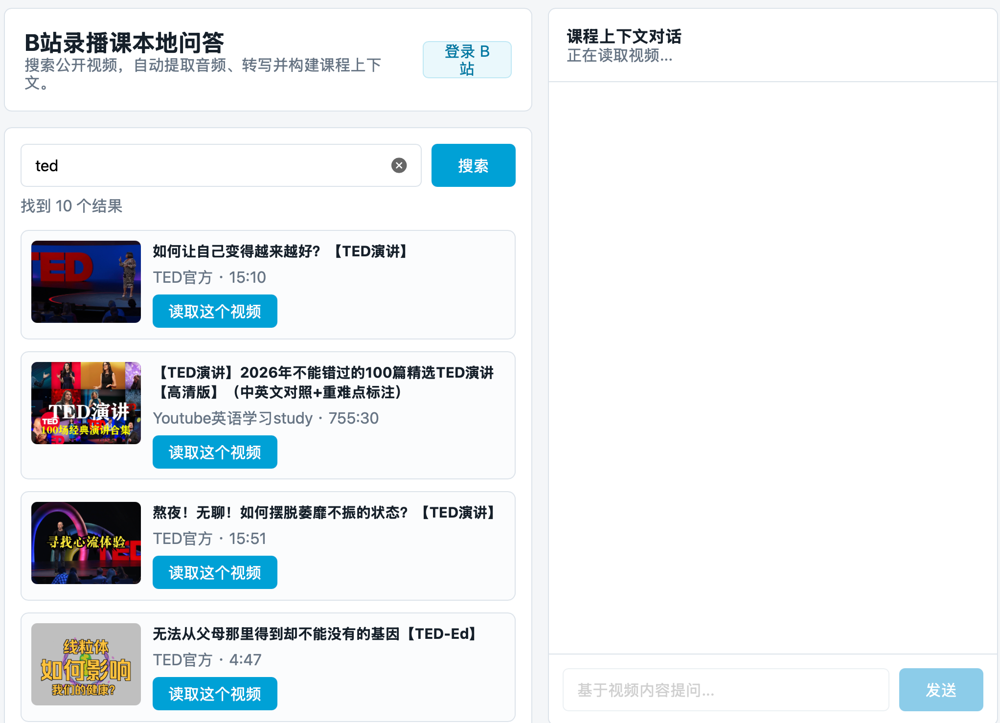
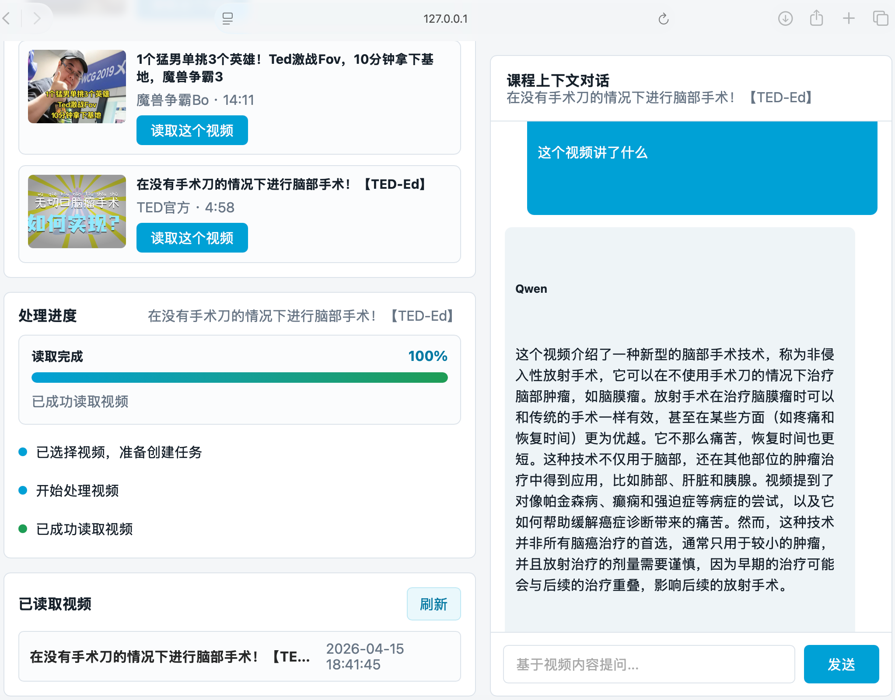

# Bilibili Agent：B站录播课本地 RAG 问答系统

一个本地运行的录播课教学辅助系统。用户输入 B 站课程关键词或直接粘贴 BV 号/视频链接，系统会搜索公开视频、下载音频、语音转文字、构建本地 RAG 索引，并使用本地 Qwen 模型基于视频上下文进行问答。

项目适合课程复习、录播课知识点检索、视频内容总结和本地隐私保护场景。

## 运行示例

搜索 B 站公开视频并选择需要读取的视频：



视频读取完成后，基于视频上下文向本地 Qwen 提问：



## 核心功能

- B 站公开视频模糊搜索，也支持直接输入 BV 号或视频链接。
- 自动下载视频音频，不强制保存完整视频。
- 使用 `faster-whisper` 将音频转写为带时间戳文本。
- 按时间片段切分转写结果，构建本地 RAG 检索索引。
- 支持本地 Qwen 模型流式问答。
- 支持 Ollama，也支持 Anaconda AI Navigator API Server 这类 OpenAI-compatible 本地接口。
- 页面展示处理进度、进度条、已读取视频列表和上下文对话。
- 数据默认保存在本地 `data/` 目录，避免视频内容上传到云端。

## 技术结构

```text
用户页面
  ├─ B站搜索 / BV号输入
  ├─ 视频选择
  ├─ 处理进度 SSE
  └─ RAG 对话流式输出

Flask 后端
  ├─ /api/search                 搜索 B站公开视频
  ├─ /api/videos/process         创建视频处理任务
  ├─ /api/tasks/<id>/events      SSE 返回处理进度
  ├─ /api/videos                 已处理视频列表
  ├─ /api/chat                   基于视频上下文问答
  └─ /api/image-proxy            B站封面图片代理

处理流水线
  ├─ yt-dlp 下载音频
  ├─ faster-whisper 音频转写
  ├─ transcript.json / transcript.txt 持久化
  ├─ 文本分块 + 时间戳
  ├─ sentence-transformers 向量化
  └─ 本地 RAG 检索 + Qwen 生成回答
```

## 项目目录

```text
.
├── app.py                    # Flask 入口和 API 路由
├── requirements.txt          # Python 依赖
├── services/
│   ├── bilibili.py           # B站搜索、音频下载、cookies 支持
│   ├── config.py             # 环境变量配置
│   ├── llm.py                # Ollama / OpenAI-compatible 本地模型调用
│   ├── rag.py                # 文本切分、向量化、检索
│   ├── storage.py            # 视频元数据和文件路径管理
│   ├── tasks.py              # 后台处理任务和 SSE 进度事件
│   └── transcribe.py         # faster-whisper 转写
├── static/
│   ├── app.js                # 前端交互逻辑
│   └── style.css             # 页面样式
├── templates/
│   └── index.html            # 单页应用
├── tests/
│   └── test_core.py          # 核心单元测试
└── docs/images/              # README 运行截图
```

## 环境准备

推荐使用 Anaconda 创建独立环境：

```bash
conda create -n teaching-agent python=3.11 -y
conda activate teaching-agent
python -m pip install --upgrade pip
pip install -r requirements.txt
conda install -c conda-forge ffmpeg -y
```

如果你不使用 Anaconda，也可以使用 Python 虚拟环境：

```bash
python3 -m venv .venv
source .venv/bin/activate
pip install -r requirements.txt
```

## 使用 Anaconda AI Navigator 模型

如果你的模型在 Anaconda AI Navigator 中运行，API Server 显示：

```text
Server Address: 127.0.0.1
Server Port: 8080
Model: Qwen1.5-7B-Chat
```

运行项目前设置：

```bash
export LLM_PROVIDER=openai
export OPENAI_COMPAT_BASE_URL=http://127.0.0.1:8080/v1
export OPENAI_COMPAT_MODEL=Qwen1.5-7B-Chat
python app.py
```

如果 Anaconda AI Navigator 中配置了 API Key，再额外设置：

```bash
export OPENAI_COMPAT_API_KEY=你的APIKey
```

## 使用 Ollama 模型

如果使用 Ollama：

```bash
ollama pull qwen2.5:7b-instruct
ollama serve
```

然后在另一个终端运行：

```bash
export LLM_PROVIDER=ollama
export OLLAMA_BASE_URL=http://localhost:11434
export OLLAMA_MODEL=qwen2.5:7b-instruct
python app.py
```

## 启动项目

```bash
cd /path/to/bilibili_agent
conda activate teaching-agent
python app.py
```

浏览器打开：

```text
http://127.0.0.1:5000
```

使用流程：

1. 输入 B 站课程关键词，或直接粘贴 BV 号/视频链接。
2. 点击搜索。
3. 选择一个公开视频并点击“读取这个视频”。
4. 等待进度条显示“读取完成”。
5. 在右侧对话框基于视频内容提问。

## 配置项

可以通过环境变量覆盖默认值：

```bash
export LLM_PROVIDER=ollama
export OLLAMA_BASE_URL=http://localhost:11434
export OLLAMA_MODEL=qwen2.5:7b-instruct
export OPENAI_COMPAT_BASE_URL=http://127.0.0.1:8080/v1
export OPENAI_COMPAT_MODEL=Qwen1.5-7B-Chat
export OPENAI_COMPAT_API_KEY=
export EMBEDDING_MODEL=BAAI/bge-small-zh-v1.5
export WHISPER_MODEL=small
export DATA_DIR=./data
export BILIBILI_COOKIE_PATH=./data/bilibili-cookies.txt
```

## 本地数据

默认数据保存在 `data/`，该目录不会提交到 Git：

```text
data/videos/<video_id>/audio.mp3
data/videos/<video_id>/transcript.json
data/videos/<video_id>/transcript.txt
data/videos/<video_id>/chunks.jsonl
data/videos/<video_id>/vectors.json
data/videos/<video_id>/meta.json
```

## 测试

```bash
python -m py_compile app.py services/*.py tests/test_core.py
python -m unittest discover -s tests
```

## 注意事项

- 第一版主流程面向 B 站公开视频。
- 登录和 cookies 是可选增强，系统不会绕过验证码、短信验证或平台风控。
- 处理长视频时，音频下载和 Whisper 转写可能需要几分钟。
- 请确保只处理你有权访问和使用的视频内容。
